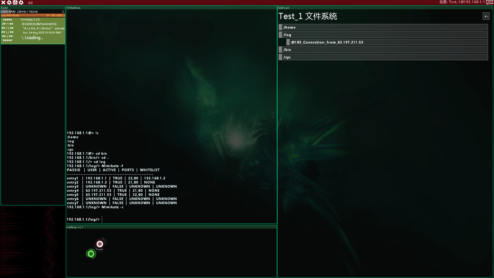

TempestGadgets - 一个[Hacknet](https://store.steampowered.com/app/365450/Hacknet/) [Pathfinder](https://github.com/Arkhist/Hacknet-Pathfinder)模组
===
TempestGadgets提供了一些新的exe, 允许玩家破解更多的端口

如果你遇到了Bug或者有什么改进的想法, 欢迎发issue或者在Discord **@rs_nongyao**

##  新的`Executibles`
每个exe都有重做的图像和新的机制:
- `#VPN_BYPASS#`|`VPNBypass.exe`:破解[0DTK](https://github.com/prodzpod/ZeroDayToolKit)的`123 (Network Time Protocol)`端口
  - 此exe需要`443 (HTTPS)`端口开启以运行
  - 在`123`端口开启后, `443`端口会被关闭, `VPNBypass`会保持运行直至被手动`kill`结束进程
  - 此exe被`kill`后, 会关闭已开启的`443`端口, 你需要在`VPNBypass`保持运行时开启`443`端口才能同时开启两个端口
- `#EOS_ROOTKIT#`|`eOSRootKit.exe`:破解`3659 (eOS Connection Manager)`端口
  - 此exe只能在管理员密码**不为**`alpine`的节点运行
  - 在`3659`端口开启后, 节点会在60s后自动重启, 并重设`3659`端口和**管理员密码以及管理员权限**---时刻注意节点状态!
- `#NET_SPOOF#`|`NetSpoof.exe`:破解`211 (Transfer)`端口
- `#SIGNAL_FILTER#`|`SignalFilter.exe`:破解`32 (SignalScramble)`端口
  - `SignalFilter`会保持运行直至被手动`kill`结束进程
  - 在`32`端口开启后, 会进行至多7次的随机操作, 每次操作都会随机选择端口开启或关闭---看运气!
  - 此exe被`kill`后, 会**强制关闭**`32`端口以及随机操作的所有端口
- `#PASSPORT_READER#`|`Mimikatz.exe`:读取/下载节点内所有的PassPort令牌 (详见[PassPort](./example/TestNode.xml)系统)
- `#PASSPORT_INJECT#`|`PPInjector.exe`:执行PassPort令牌文件 (详见[PassPort](./example/TestNode.xml)系统)
- `#ENSEC_BREAKER#`|`EnSecBreaker.exe`:破解EnSec使破解所需端口数降低(移植于[XMOD](https://github.com/tenesiss/Hacknet-Pathfinder-XMOD-Dev)
  - 此exe需要先破解4个必需的端口才能运行
  - 在破解途中会至多执行4个强制性的`ForkBomb`, 无法通过Trap避免触发
  - 在破解完成后, 有25%的概率会重置所有端口 
- `#FRWALL_DEFACER#`|`FirewallDefacer.exe`:破解防火墙(移植于[XMOD](https://github.com/tenesiss/Hacknet-Pathfinder-XMOD-Dev) (等待实施)
- 等待更新

## 新的`Action`
- `<EnableScreenGlitch GlitchMult="float" />`|`<DisableScreenGlitch />`:开启/关闭屏幕抖动效果, 使用GltchMult (0~1的数) 来控制抖动程度
- `<SwitchPPEntry target="CompID" path="<path>" name="example.passport" id="entryID" isActive="bool" />`:切换PassPort条目的可用性 (详见[PassPort](./example/TestNode.xml)系统)
- 等待更新

## 新的`Daemon`
- 等待更新

## 新的`Goals`
- 等待更新

## `PassPort`系统
全新的PassPort系统,让Hacknet支持主动运行Action!

详见[PassPort](./example/TestNode.xml)系统以查看全部说明.
